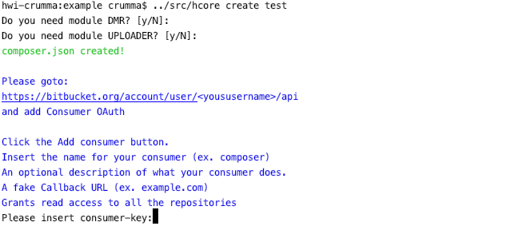

### Documentation

*   [Introduction](#introduction)
*   [Usage](#usage)
*   [Create your Application](#create_your_app)
*   [Modules](#modules)
*   [Widget Override](#widget_override)

## [Introduction](#introduction)

hcore/cli the command-line interface included with HCore. It provides a number of helpful commands for your use while developing your application.

## [Usage](#usage)

#### Listing All Available Commands

To view a list of all available hcore/cli commands, you may use the "-h, --help" option:

    hcore -h

#### Viewing The Help Screen For A Command

Every command also includes a "help" screen which displays and describes the command's available arguments and options. To view a help screen, simply precede the name of the command with `help`:

    hcore create help

#### Displaying Your Current hcore/cli Version

You may also view the current version of your hcore/cli installation using the "-V, --version" option:

    hcore -V

## [Create your Application](#create_your_app)

to create your own project 
go to the project folder and launch this command:

    hcore create <your-project-name>

the command will ask you if you want to download additional modules (by default it will download them).

follow the instructions to create your consumer key on the settings of your BitBucket account and enter the required key and secret.

At the end of the execution the project structure will be created.

## [Modules](#modules)

you can remove a module after installation using the command:

    hcore module:remove <module_name>

Example:
    
    hcore module:remove hcore/dmr
    

## [Widget Override](#widget_override)

to override a widget use the command:

    hcore widget:create <module/widget>

where "module/widget" is the widget path.
For Example if you want to override the login widget launch:
    
    hcore widget:create auth/login

if only the module is specified all the module widgets will be overwritten
    
    hcore widget:create auth
