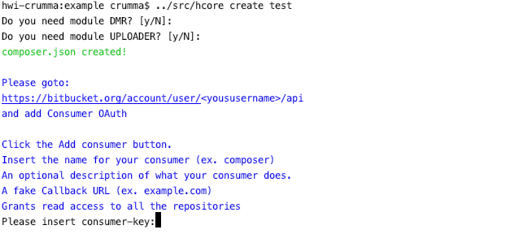

### hcore/cli   [](https://travis-ci.org/CarmineRummaHwi/hcore-cli)
**HCore Command Line Tools**
                 
[](https://packagist.org/packages/hcore/cli)
[](https://packagist.org/packages/hcore/cli)

**hcore/cli** utilizes [Composer](https://getcomposer.org) to manage its
dependencies. So, before using HCore/CLI, make sure you have Composer
installed on your machine.

First, download the HCore/CLI using Composer:

    composer global require hcore/cli

to update HCore/CLI to latest version

    composer global update hcore/cli

Make sure to place Composer's system-wide vendor bin directory in your
`$PATH`{.language-php} so the HCORE executable can be located by your
system. This directory exists in different locations based on your
operating system; however, some common locations include:

-   macOS and GNU / Linux Distributions:
    `$HOME/.composer/vendor/bin`
-   Windows:
    `%USERPROFILE%\AppData\Roaming\Composer\vendor\bin`

> on some windows computers the global composer folder may be different.
You can query Composer to find where it has set the user $COMPOSER_HOME directory
by running this command:
```php
composer global config home 
```

#
**`Documentation`**

*   [Introduction](#introduction)
*   [Usage](#usage)
*   [Create your Application](#createyourapp)
*   [Modules](#modules)
*   [Widget Override](#widgetoverride)

## [Introduction](#introduction)

hcore/cli the command-line interface included with HCore. It provides a number of helpful commands for your use while developing your application.

## [Usage](#usage)

#### Listing All Available Commands

To view a list of all available hcore/cli commands, you may use the "-h, --help" option:

    hcore -h

#### Viewing The Help Screen For A Command

Every command also includes a "help" screen which displays and describes the command's available arguments and options. To view a help screen, simply precede the name of the command with `help`:

    hcore create help

#### Displaying Your Current hcore/cli Version

You may also view the current version of your hcore/cli installation using the "-V, --version" option:

    hcore -V

## [Create your Application](#createyourapp)

to create your own project 
go to the project folder and launch this command:

    hcore create <your-project-name>

the command will ask you if you want to download additional modules (by default it will download them).



follow the instructions to create your consumer key on the settings of your BitBucket account and enter the required key and secret.

At the end of the execution the project structure will be created.

Note: sometimes the BitBucket OAuth may not work. In that case launch first the command: 
    
    composer clearcache


##### require-dev
The command after creating the composer.json launches the "composer install" without the require-devs.
To include these add the "-d, --dev" option

##### generate only composer.json without install
if you want the command to generate only the composer.json file
add the "-j, --json" option.


## [Modules](#modules)

you can add or remove a module after installation.
- To remove an existing module launch the command:

        hcore module:remove <module_name>

    Example:
    
        hcore module:remove dmr
        hcore module:remove uploader
    
- To add a new hcore module launch the command:
    
        hcore module:add <module_name>
    
    Example:
        
        hcore module:add auth
        hcore module:add uploader
        
    ##### require-dev
    The command after updating the composer.json launches the "composer install" without the require-devs.
    To include these add the "-d, --dev" option
    
    ##### generate only composer.json without install
    if you want the command to update only the composer.json file
    add the "-j, --json" option.
    
## [Widget Override](#widgetoverride)

to override a widget use the command:

    hcore widget:create <module/widget>

where "module/widget" is the widget path.
For Example if you want to override the login widget launch:
    
    hcore widget:create auth/login

if only the module is specified all the module widgets will be overwritten
    
    hcore widget:create auth
